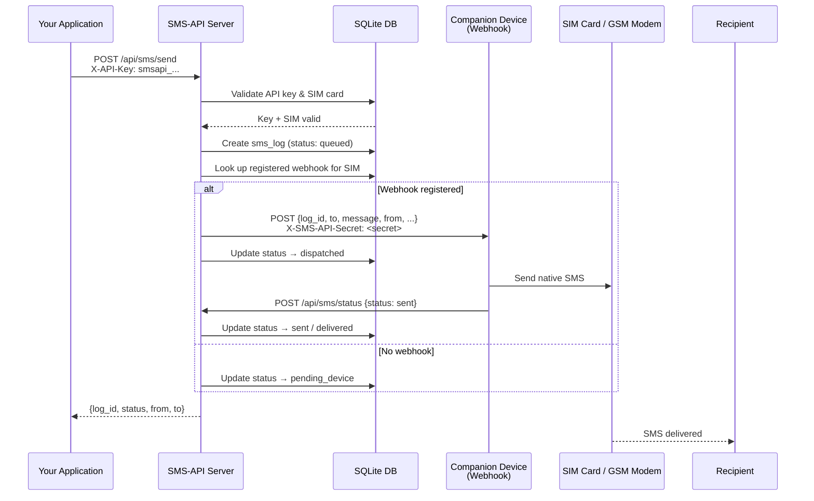
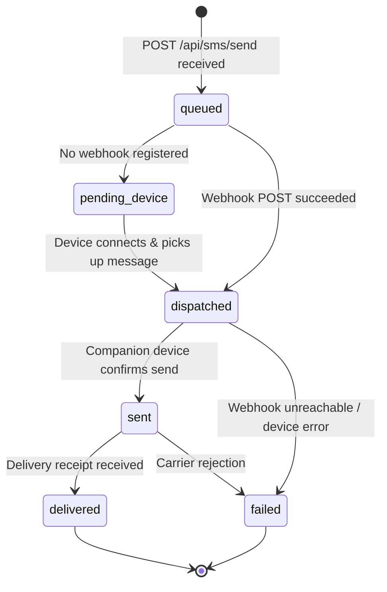

# SMS-API

> A REST API platform that lets users in India register their SIM card phone numbers as SMS senders and programmatically route messages through those SIM cards for their businesses, tools, or platforms.

---

## Table of Contents

- [How It Works](#how-it-works)
- [Interfaces](#interfaces)
- [Quick Start](#quick-start)
- [Architecture](#architecture)
- [Message Flow](#message-flow)
- [SMS Status Lifecycle](#sms-status-lifecycle)
- [Database Schema](#database-schema)
- [Web UI](#web-ui)
- [CLI](#cli)
- [API Reference](#api-reference)
  - [Authentication](#authentication)
  - [Auth Endpoints](#auth-endpoints)
  - [SIM Cards](#sim-cards)
  - [API Keys](#api-keys)
  - [Sending SMS](#sending-sms)
  - [Webhooks](#webhooks)
- [Environment Variables](#environment-variables)
- [Tech Stack](#tech-stack)
- [Running Tests](#running-tests)
- [Architecture Notes](#architecture-notes)

---

## How It Works

1. **Register** – Create an account on the platform.
2. **Add your SIM** – Register your Indian mobile number and verify ownership with a one-time password (OTP).
3. **Generate an API key** – Create a key that your application uses to authenticate requests.
4. **Send SMS** – Call `POST /api/sms/send` from your application. Messages are routed through your verified SIM card.
5. **Companion Device** – Install the companion app on the phone whose SIM card you registered. The app polls or listens for webhook events and delivers messages using the device's native SMS capability. Alternatively connect a GSM modem to the webhook endpoint.

---

## Interfaces

| Interface | Access Point | Description |
|-----------|-------------|-------------|
| **Web UI** | `http://localhost:3000` | Browser dashboard for managing accounts, SIM cards, API keys, and logs |
| **CLI** | `sms-api` command | Command-line tool for scripting and terminal-based workflows |
| **REST API** | `http://localhost:3000/api` | Programmatic HTTP access (documented below) |

---

## Quick Start

### Prerequisites

| Requirement | Version |
|------------|---------|
| Node.js | 18+ |

### Installation

```bash
git clone https://github.com/pangerlkr/SMS-API.git
cd SMS-API
npm install
cp .env.example .env       # edit JWT_SECRET
npm start
```

The server starts on `http://localhost:3000` by default.

---

## Architecture

```
┌─────────────────────────────────────────────────────────────────┐
│                          SMS-API Platform                        │
│                                                                  │
│  ┌──────────┐   ┌──────────┐   ┌──────────┐   ┌─────────────┐  │
│  │  Web UI  │   │   CLI    │   │ REST API │   │  /health    │  │
│  │:3000     │   │ sms-api  │   │  /api/*  │   │  endpoint   │  │
│  └────┬─────┘   └────┬─────┘   └────┬─────┘   └─────────────┘  │
│       └──────────────┴──────────────┘                            │
│                            │                                     │
│                    ┌───────▼────────┐                            │
│                    │  Express App   │                            │
│                    │  + Helmet/CORS │                            │
│                    │  + Rate Limit  │                            │
│                    └───────┬────────┘                            │
│                            │                                     │
│          ┌─────────────────┼─────────────────┐                  │
│          │                 │                 │                   │
│   ┌──────▼──────┐  ┌───────▼──────┐  ┌──────▼──────┐           │
│   │  JWT Auth   │  │  API Key     │  │  Validators │           │
│   │  Middleware │  │  Middleware  │  │  (express-  │           │
│   └──────┬──────┘  └───────┬──────┘  │  validator) │           │
│          │                 │         └─────────────┘           │
│          └─────────────────┘                                    │
│                            │                                    │
│                    ┌───────▼────────┐                           │
│                    │  Controllers   │                           │
│                    │  auth / sim /  │                           │
│                    │  keys / sms /  │                           │
│                    │  webhooks      │                           │
│                    └───────┬────────┘                           │
│                            │                                    │
│                    ┌───────▼────────┐                           │
│                    │  SQLite DB     │                           │
│                    │  (sql.js /     │                           │
│                    │   WebAssembly) │                           │
│                    └────────────────┘                           │
└─────────────────────────────────────────────────────────────────┘
```

---

## Message Flow



---

## SMS Status Lifecycle



| Status | Meaning |
|--------|---------|
| `queued` | Message received by the server, not yet dispatched |
| `pending_device` | No webhook registered; waiting for a companion device to connect |
| `dispatched` | Message forwarded to the companion device via webhook |
| `sent` | Companion device confirms the SMS was sent from the SIM |
| `delivered` | Delivery receipt received from the carrier |
| `failed` | Delivery failed (webhook unreachable or carrier error) |

---

## Database Schema

The platform uses a SQLite database with five tables:

### `users`

| Column | Type | Notes |
|--------|------|-------|
| `id` | TEXT | Primary key (UUID) |
| `name` | TEXT | Display name |
| `email` | TEXT | Unique, used for login |
| `password_hash` | TEXT | bcrypt hash |
| `created_at` | TEXT | ISO 8601 timestamp |

### `sim_cards`

| Column | Type | Notes |
|--------|------|-------|
| `id` | TEXT | Primary key (UUID) |
| `user_id` | TEXT | FK → `users.id` |
| `phone_number` | TEXT | Indian mobile number (normalised) |
| `label` | TEXT | Optional human-readable label |
| `verified` | INTEGER | `0` = unverified, `1` = verified |
| `otp_code` | TEXT | Pending OTP (cleared after verify) |
| `otp_expires_at` | TEXT | OTP expiry timestamp |
| `active` | INTEGER | `1` = active, `0` = deactivated |
| `created_at` | TEXT | ISO 8601 timestamp |

### `api_keys`

| Column | Type | Notes |
|--------|------|-------|
| `id` | TEXT | Primary key (UUID) |
| `user_id` | TEXT | FK → `users.id` |
| `key_value` | TEXT | Unique, prefixed `smsapi_…` |
| `name` | TEXT | Human-readable label |
| `active` | INTEGER | `1` = active, `0` = revoked |
| `last_used_at` | TEXT | Updated on each authenticated request |
| `created_at` | TEXT | ISO 8601 timestamp |

### `sms_logs`

| Column | Type | Notes |
|--------|------|-------|
| `id` | TEXT | Primary key (UUID) |
| `user_id` | TEXT | FK → `users.id` |
| `sim_card_id` | TEXT | FK → `sim_cards.id` |
| `api_key_id` | TEXT | FK → `api_keys.id` |
| `to_number` | TEXT | Recipient phone number |
| `message` | TEXT | SMS body |
| `status` | TEXT | See [SMS Status Lifecycle](#sms-status-lifecycle) |
| `error_message` | TEXT | Populated on failure |
| `sent_at` | TEXT | Timestamp when `sent` status was set |
| `created_at` | TEXT | ISO 8601 timestamp |

### `webhooks`

| Column | Type | Notes |
|--------|------|-------|
| `id` | TEXT | Primary key (UUID) |
| `user_id` | TEXT | FK → `users.id` |
| `sim_card_id` | TEXT | FK → `sim_cards.id` |
| `endpoint_url` | TEXT | Companion device URL |
| `secret` | TEXT | Shared secret sent in `X-SMS-API-Secret` header |
| `active` | INTEGER | `1` = active, `0` = deleted |
| `created_at` | TEXT | ISO 8601 timestamp |

---

## Web UI

Open `http://localhost:3000` in your browser. You can:

| Tab | What you can do |
|-----|----------------|
| **Register / Log in** | Create an account or sign in |
| **SIM Cards** | Register an Indian mobile number and verify it with an OTP |
| **API Keys** | Create and revoke API keys (full key shown once at creation) |
| **Send SMS** | Send a message using an API key and a verified SIM card |
| **Logs** | Paginated history of all outbound messages |
| **Webhooks** | Register companion device endpoints for message delivery |

---

## CLI

Install the CLI globally after running `npm install`:

```bash
npm link          # makes 'sms-api' available system-wide
# or run directly:
node src/cli/index.js --help
```

By default the CLI talks to `http://localhost:3000`. Override with `--url` or the `$SMSAPI_URL` environment variable.

### Available Commands

| Command | Description |
|---------|-------------|
| `sms-api register` | Create a new account (interactive prompts) |
| `sms-api login` | Log in and store credentials locally |
| `sms-api logout` | Clear stored credentials |
| `sms-api profile` | Show your account profile |
| `sms-api sim list` | List registered SIM cards |
| `sms-api sim add` | Register a new Indian SIM card |
| `sms-api sim verify` | Verify a SIM card with its OTP |
| `sms-api sim resend` | Resend the OTP for an unverified SIM card |
| `sms-api sim remove <id>` | Deactivate a SIM card |
| `sms-api keys list` | List API keys |
| `sms-api keys create` | Create a new API key |
| `sms-api keys revoke <id>` | Revoke an API key |
| `sms-api sms send` | Send an SMS (uses X-API-Key) |
| `sms-api sms logs` | View paginated SMS logs |
| `sms-api webhooks list` | List registered webhooks |
| `sms-api webhooks add` | Register a companion device webhook |
| `sms-api webhooks remove <id>` | Delete a webhook |

Credentials (JWT token) are stored in `~/.smsapi/config.json` after login. Pass all values as flags or let the CLI prompt interactively.

**Example workflow:**

```bash
sms-api register --name "Rahul" --email rahul@example.com --password secret123
sms-api sim add --phone +919876543210 --label "Business"
# Copy the sim_card_id and otp_for_testing from the output, then:
sms-api sim verify --id <sim_card_id> --otp <otp>
sms-api keys create --name "My App"
# Copy the full key value, then:
sms-api sms send --key smsapi_... --to 9123456789 --message "Hello from CLI!"
sms-api sms logs
```

---

## API Reference

### Base URL

```
http://localhost:3000/api
```

### Authentication

The platform uses two authentication mechanisms:

| Mechanism | Header | Used for |
|-----------|--------|----------|
| **JWT Bearer** | `Authorization: Bearer <token>` | User management – SIM cards, API keys, logs |
| **API Key** | `X-API-Key: smsapi_...` | Sending SMS from your application |

### Endpoint Summary

| Method | Path | Auth | Description |
|--------|------|------|-------------|
| `POST` | `/api/auth/register` | None | Create a new user account |
| `POST` | `/api/auth/login` | None | Log in and receive a JWT |
| `GET` | `/api/auth/profile` | JWT | Fetch your profile |
| `POST` | `/api/sim/register` | JWT | Register a new SIM card |
| `POST` | `/api/sim/verify` | JWT | Verify SIM ownership via OTP |
| `POST` | `/api/sim/resend` | JWT | Resend verification OTP for an unverified SIM card |
| `GET` | `/api/sim` | JWT | List your SIM cards |
| `DELETE` | `/api/sim/:id` | JWT | Deactivate a SIM card |
| `POST` | `/api/keys` | JWT | Create an API key |
| `GET` | `/api/keys` | JWT | List API keys (masked values) |
| `DELETE` | `/api/keys/:id` | JWT | Revoke an API key |
| `POST` | `/api/sms/send` | API Key | Send an SMS |
| `POST` | `/api/sms/status` | API Key | Update delivery status (companion device callback) |
| `GET` | `/api/sms/logs` | JWT | View paginated SMS logs |
| `POST` | `/api/webhooks` | JWT | Register a companion device webhook |
| `GET` | `/api/webhooks` | JWT | List webhooks |
| `DELETE` | `/api/webhooks/:id` | JWT | Delete a webhook |
| `GET` | `/health` | None | Health check |

---

### Auth Endpoints

#### Register

```
POST /api/auth/register
```

**Body:**
```json
{
  "name": "Rahul Sharma",
  "email": "rahul@example.com",
  "password": "securepassword123"
}
```

**Response `201`:**
```json
{
  "message": "User registered successfully",
  "token": "<jwt>",
  "user": { "id": "...", "name": "Rahul Sharma", "email": "rahul@example.com" }
}
```

#### Login

```
POST /api/auth/login
```

**Body:**
```json
{ "email": "rahul@example.com", "password": "securepassword123" }
```

**Response `200`:**
```json
{ "message": "Login successful", "token": "<jwt>", "user": { ... } }
```

#### Get Profile

```
GET /api/auth/profile
Authorization: Bearer <jwt>
```

---

### SIM Cards

All SIM card endpoints require `Authorization: Bearer <jwt>`.

#### Register a SIM Card

```
POST /api/sim/register
```

**Body:**
```json
{
  "phone_number": "+919876543210",
  "label": "Business SIM"
}
```

Accepted formats for Indian numbers:

| Format | Example |
|--------|---------|
| International | `+91XXXXXXXXXX` |
| Without `+` | `91XXXXXXXXXX` |
| With leading `0` | `0XXXXXXXXXX` |
| 10-digit | `XXXXXXXXXX` |

**Response `201`:**
```json
{
  "message": "SIM card registered. Please verify using the OTP sent to your number.",
  "sim_card_id": "uuid",
  "otp_for_testing": "123456"
}
```

> **Note:** In production, the OTP is delivered via SMS to the registered number. The `otp_for_testing` field is present for development convenience and should be removed in production.

#### Verify a SIM Card

```
POST /api/sim/verify
```

**Body:**
```json
{ "sim_card_id": "uuid", "otp": "123456" }
```

#### Resend Verification OTP

```
POST /api/sim/resend
```

Use this when the OTP has expired or was not received. Generates and returns a fresh 6-digit OTP for the given unverified SIM card.

**Body:**
```json
{ "sim_card_id": "uuid" }
```

**Response `200`:**
```json
{
  "message": "OTP resent. Please verify your SIM card.",
  "sim_card_id": "uuid",
  "otp_for_testing": "654321"
}
```

Returns `409` if the SIM card is already verified, `404` if the SIM card is not found.

#### List SIM Cards

```
GET /api/sim
```

#### Remove a SIM Card

```
DELETE /api/sim/:id
```

---

### API Keys

All API key endpoints require `Authorization: Bearer <jwt>`.

#### Create API Key

```
POST /api/keys
```

**Body:**
```json
{ "name": "My Business App" }
```

**Response `201`:**
```json
{
  "message": "API key created",
  "api_key": {
    "id": "uuid",
    "name": "My Business App",
    "key_value": "smsapi_...",
    "created_at": "..."
  },
  "warning": "Store this key securely. It will not be shown in full again."
}
```

#### List API Keys

```
GET /api/keys
```

Key values are masked in the listing response.

#### Revoke API Key

```
DELETE /api/keys/:id
```

---

### Sending SMS

#### Send an SMS

```
POST /api/sms/send
X-API-Key: smsapi_...
```

**Body:**

| Field | Type | Required | Description |
|-------|------|----------|-------------|
| `to` | string | Yes | Recipient phone number |
| `message` | string | Yes | SMS body text |
| `sim_card_id` | string | No | UUID of SIM to use; defaults to first verified SIM |

```json
{
  "to": "9123456789",
  "message": "Your OTP is 456789",
  "sim_card_id": "uuid"
}
```

**Response `200`:**
```json
{
  "message": "SMS queued. Connect a companion device or register a webhook to complete delivery.",
  "log_id": "uuid",
  "from": "9876543210",
  "to": "9123456789",
  "status": "pending_device"
}
```

#### Update Delivery Status (Companion Device Callback)

```
POST /api/sms/status
X-API-Key: smsapi_...
```

**Body:**
```json
{
  "log_id": "uuid",
  "status": "sent",
  "error_message": null
}
```

#### View SMS Logs

```
GET /api/sms/logs?page=1&limit=20
Authorization: Bearer <jwt>
```

---

### Webhooks

Register an HTTP endpoint on your companion device. When an SMS is sent, the platform will POST the message details to this URL so the device can deliver it.

All webhook endpoints require `Authorization: Bearer <jwt>`.

#### Register Webhook

```
POST /api/webhooks
```

**Body:**
```json
{
  "sim_card_id": "uuid",
  "endpoint_url": "https://your-device.example.com/sms",
  "secret": "optional-shared-secret"
}
```

**Webhook payload** (sent by the server to your device):

| Field | Type | Description |
|-------|------|-------------|
| `log_id` | string | UUID of the SMS log entry |
| `to` | string | Recipient phone number |
| `message` | string | SMS body |
| `from` | string | Sender's phone number (your SIM) |
| `webhook_id` | string | UUID of the webhook |
| `timestamp` | string | ISO 8601 send time |

```json
{
  "log_id": "uuid",
  "to": "9123456789",
  "message": "Your OTP is 456789",
  "from": "9876543210",
  "webhook_id": "uuid",
  "timestamp": "2024-01-01T00:00:00.000Z"
}
```

The shared secret is passed in the `X-SMS-API-Secret` header so you can verify authenticity.

#### List Webhooks

```
GET /api/webhooks
```

#### Delete Webhook

```
DELETE /api/webhooks/:id
```

---

## Environment Variables

| Variable | Default | Required | Description |
|----------|---------|----------|-------------|
| `PORT` | `3000` | No | HTTP port the server listens on |
| `JWT_SECRET` | — | **Yes (prod)** | Secret used to sign JWTs; use a long random string |
| `JWT_EXPIRES_IN` | `7d` | No | JWT expiry duration (e.g. `1h`, `7d`, `30d`) |
| `DB_PATH` | `./data/sms_api.db` | No | Path to the SQLite database file |

---

## Tech Stack

| Layer | Technology | Notes |
|-------|-----------|-------|
| Runtime | Node.js 18+ | |
| Framework | Express 4 | REST API + static file server |
| Security | Helmet, CORS | CSP, XSS, and CORS hardening |
| Rate Limiting | express-rate-limit | 100 req / 15 min per IP |
| Authentication | jsonwebtoken, bcryptjs | JWT for users, API key for sends |
| Validation | express-validator | Request body validation |
| Database | sql.js (SQLite/WASM) | No native build required |
| CLI | Commander.js | `sms-api` binary |
| Testing | Jest + Supertest | `npm test` |
| Dev Server | Nodemon | `npm run dev` |

---

## Running Tests

```bash
npm test
```

---

## Architecture Notes

- **Database:** SQLite via [sql.js](https://github.com/sql-js/sql.js) (pure WebAssembly – no native build required). For high-volume production deployments, swap `src/db/index.js` for a PostgreSQL/MySQL adapter.
- **SIM Verification:** OTP is currently returned in the API response (`otp_for_testing`). In production, integrate an SMS provider (e.g. MSG91, Exotel, Textlocal) to deliver the OTP to the handset.
- **Message Delivery:** The platform routes messages to your physical device via webhooks. The companion mobile app (Android/iOS) or a GSM modem connected to a server listens on the webhook URL and uses the SIM card to send the message natively.
- **Rate Limiting:** 100 requests per 15 minutes per IP.
